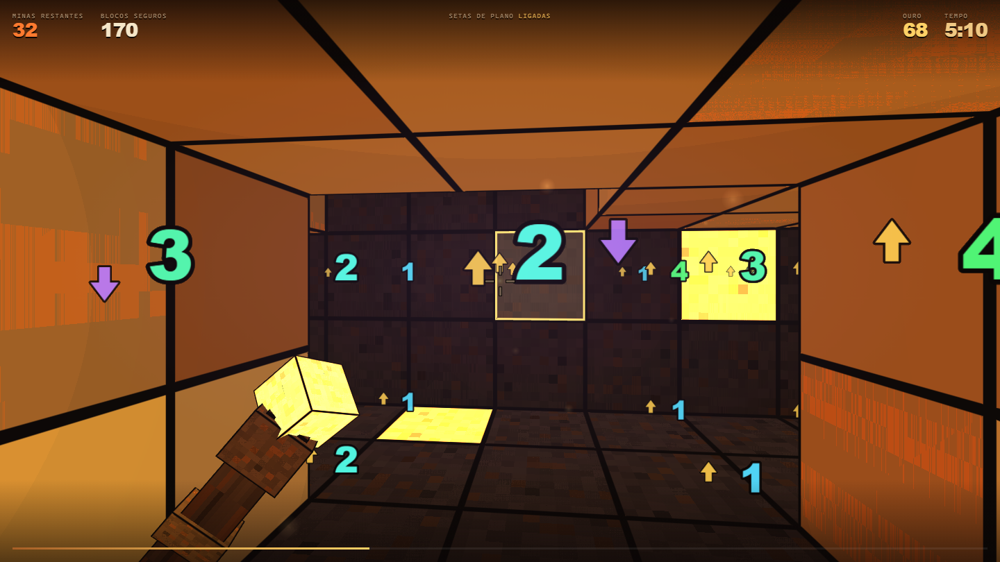

# Campo Minado — Três Planos

Campo minado em primeira pessoa. Você não olha o tabuleiro de cima: você está **dentro** dele,
numa caverna de areia de três camadas, com um cajado na mão.

**▶ Jogar: https://le-birnes.github.io/campo-minado/**

## O que muda em relação ao campo minado clássico

- **26 vizinhos por bloco**, não 8. Um cubo encosta em 3×3×3 − 1 outros cubos, então o número
  que aparece conta minas do seu plano, do teto **e** do chão.
- **Setas de plano.** Seta dourada pra cima = há mina em algum dos 9 blocos do teto.
  Seta roxa pra baixo = no chão. Se houver dos dois lados, as setas giram em volta do número.
  Tecla `T` desliga, se você quiser sofrer.
- **Você atira nos blocos** em vez de clicar. Só dá pra acertar o que está à vista, então a
  linha de visada virou parte do quebra-cabeça.
- **Atirar no número** acende, por alguns segundos, todos os blocos que ele conta. Se as minas
  dele já estiverem marcadas, o tiro **espalha** e derruba o resto — marcou errado, a caverna vai junto.
- **Verticalidade.** Pulo curto sobe 3× a altura do personagem; segurando o espaço por 0,5 s
  no ar, o cajado sustenta a subida até 5×.

## Controles

| | |
|---|---|
| `W A S D` | andar |
| `Shift` | correr |
| `Espaço` | pular · segure 0,5 s no ar pra subir mais |
| Mouse | mirar (clique na tela pra travar o mouse) |
| Botão esquerdo | destruir bloco · acertar número acende os vizinhos |
| Botão direito | marcar mina |
| `T` | setas de plano · `I` inverter mouse vertical |
| `M` | som · `R` recomeçar · `Esc` pausa |

## Detalhes técnicos

Um único arquivo HTML, ~85 KB, sem nenhuma dependência:

- WebGL2 escrito na mão — sem Three.js, sem engine, sem build step.
- Cubos instanciados com sombreamento *cel* em degraus e contorno assado na própria face.
- Textura procedural quantizada em pixels grossos no fragment shader (a ideia era "Noita virou 3D").
- Atlas de glifos gerado em runtime num `<canvas>`; nenhuma imagem é carregada.
- Todo o áudio é sintetizado na WebAudio: tiro, desmoronamento, mecha, explosão, vento da caverna.
- Densidade de minas com piso proposital: como `P(bloco zero) = (1−d)^26` e a percolação de sítio
  nessa vizinhança vira perto de 9,8%, abaixo de ~10% de minas a primeira inundação abre a caverna
  inteira de uma vez. O tabuleiro também é sorteado de novo até que nenhum bloco da câmara inicial
  marque zero.

Roda em qualquer navegador com WebGL2 (Chrome, Edge, Firefox). Baixar o `index.html` e abrir
direto também funciona — aí a trava do mouse é garantida.

---

## English

First-person Minesweeper. You're inside a three-layer sand cave instead of looking at a grid
from above, so every block touches **26** neighbours (3×3×3 − 1) and the numbers count mines in
the ceiling and floor as well as your own plane. Arrows next to each number tell you which plane
the mines are in. You shoot blocks instead of clicking them, which means line of sight is part of
the puzzle. Shooting a number highlights the blocks it counts — and if its mines are already
flagged, the shot chords and clears the rest.

Single HTML file, ~85 KB, zero dependencies: hand-written WebGL2, procedural cel-shaded voxel
textures, a glyph atlas generated at runtime on a canvas, and fully synthesized WebAudio. No
libraries, no assets, no build step.
