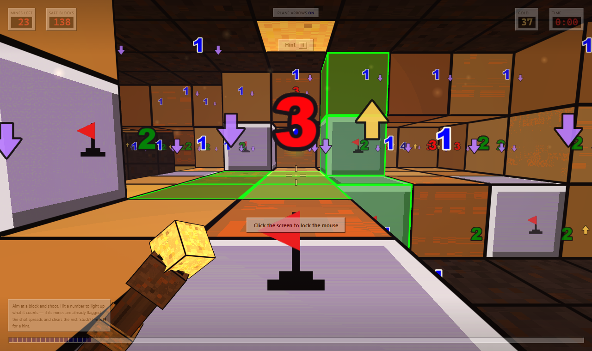

# Minesweeper — Three Planes

First-person Minesweeper. You don't look down at the grid: you're **inside** it, in a
three-layer sand cave, holding a staff.

**▶ Play: https://le-birnes.github.io/campo-minado/**

## What changes from classic Minesweeper

- **26 neighbors per block, not 8.** A cube touches 3×3×3 − 1 other cubes, so the number you
  uncover counts mines in your own plane, in the ceiling **and** in the floor.
- **Plane arrows.** A gold arrow pointing up means there's a mine in one of the 9 blocks
  overhead; a purple arrow down means the floor. When both planes have one, the arrows orbit
  the number. Press `T` to turn them off if you want it harder.
- **You shoot blocks** instead of clicking them. You can only hit what you can see, so line of
  sight became part of the puzzle.
- **Shoot a number** and every block it counts lights up for a few seconds. If those mines are
  already flagged, the shot **spreads** and clears the rest instead — flag the wrong ones and
  the whole cave goes with you.
- **Verticality.** A tap jumps 3× your height; hold space for 0.5 s midair and the staff
  sustains the climb to 5×.
- **A hint that shows its work.** `H` lights the numbers that prove the next move in cyan and
  the block they prove in green — press it again and it plays that move. It only ever reads
  what you can already see, never the mine layout. When nothing is provable, it says so and
  offers the safest guess in amber instead.

The board wears the Windows 95 palette: 1 is blue, 2 green, 3 red, 4 navy, and so on. The
original only ever needed eight colors — with 26 neighbors we can count higher, so 9 and up
repeat the same eight hues one shade lighter each time.

## Controls

| | |
|---|---|
| `W A S D` | move |
| `Shift` | sprint |
| `Space` | jump · hold 0.5 s midair to rise higher |
| Mouse | aim (click the screen to lock the pointer) |
| Left click | break a block · hitting a number lights its neighbors |
| Right click | flag a mine |
| `H` | hint · press again to play the move it found |
| `T` | plane arrows · `I` invert vertical mouse |
| `M` | sound · `R` restart · `Esc` pause |

## Technical notes

One HTML file, ~85 KB, no dependencies at all:

- **Hand-written WebGL2** — no Three.js, no engine, no build step.
- Instanced cubes with stepped cel shading and the outline baked into each face's UVs.
- Procedural material texture quantized to chunky pixels in the fragment shader (the idea was
  "what if Noita went 3D").
- Glyph atlas generated at runtime on a `<canvas>`; no image is ever loaded.
- All audio synthesized through WebAudio: shot, crumble, fuse, blast, cave wind.
- **Mine density has a deliberate floor.** Since `P(zero block) = (1 − d)^26` and site
  percolation at 26-neighbor coordination turns over near 9.8%, anything below ~10% mines lets
  the first flood fill open the entire cave at once. The board is also rerolled until no block
  of the starting chamber reads zero, so the opening never cascades.
- **The hint solver was checked against the answer key.** Over 40 boards played to completion
  with hints alone it produced 11,881 deductions and was wrong zero times; 2,321 of those came
  from the two-number subset rule. Its guess fallback picks a block that turns out to be a mine
  5.8% of the time against 12.5% for a blind pick from the same positions, and it deliberately
  overstates that risk to the player rather than understating it.

Runs in any browser with WebGL2 (Chrome, Edge, Firefox). Downloading `index.html` and opening it
directly works too — that way pointer lock is guaranteed.

## Building it

There is nothing to build. `index.html` is the whole game; open it or serve it statically.
